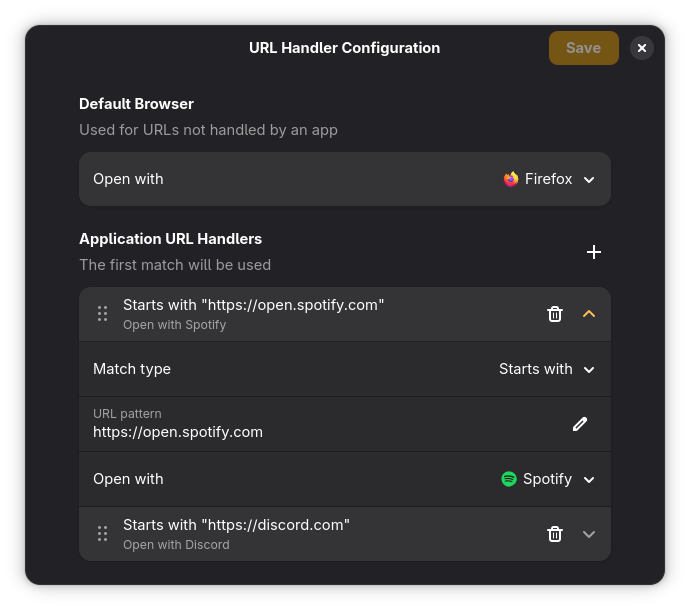

# URL Handler
Configure applications to handle certain URL types


### Installation
```
flatpak-builder --user --install --force-clean build-dir net.sowgro.URLHandler.yaml
```

### Todo
- [ ] Come up with a fun name
- [ ] Make better looking icons
- [ ] Properly handle unselected state in 'Open with' dropdown
  - Related: https://gitlab.gnome.org/GNOME/gtk/-/work_items/7168
- [ ] Reorganize this project (move away from python?)
- [ ] Publish on flathub
